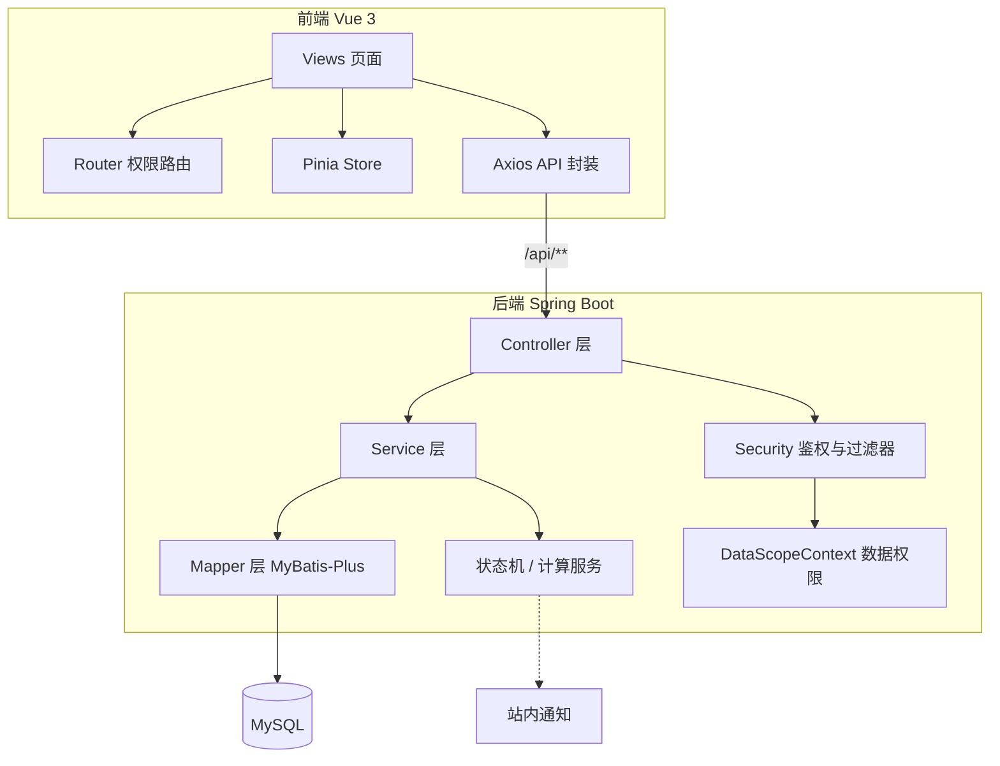

# PerfFlow 绩效考核系统

**[中文](README.md)** | **[En](README_EN.md)**

PerfFlow 是一套面向企业组织的绩效考核管理平台，覆盖**个人绩效**与**部门绩效**两条业务主线，提供从考核周期发布、指标录入、多级审批、自动计分到等级联动定级、进度看板的全流程数字化管理。系统采用前后端分离架构，内置八类角色的精细化权限隔离与双保险安全机制，适用于需要规范化绩效管理流程的中小型组织。

## 目录

- [项目背景与目标](#项目背景与目标)
- [核心功能](#核心功能)
- [整体技术架构](#整体技术架构)
- [角色与权限模型](#角色与权限模型)
- [关键设计思路](#关键设计思路)
- [目录结构](#目录结构)
- [环境依赖](#环境依赖)
- [构建与运行](#构建与运行)
- [配置说明](#配置说明)
- [数据库设计](#数据库设计)
- [测试方案](#测试方案)
- [使用示例](#使用示例)
- [扩展与维护建议](#扩展与维护建议)
- [已知事项](#已知事项)
- [贡献](#贡献)

---

## 项目背景与目标

传统绩效考核普遍面临流程分散、口径不一、权限边界模糊、统计口径难以统一等问题。PerfFlow 旨在以**规范化、可审计、可扩展**的方式解决以下痛点：

- **流程标准化**：将个人考核（发布 → 填报 → 审核 → 评分 → 定级）与部门考核（填报 → 复核 → 初审 → 审批 → 定级）固化为受控状态机，杜绝越级流转与重复提交。
- **权限精细化**：八类角色各司其职，前后端双重鉴权，数据按角色与部门维度隔离，避免越权访问。
- **计算自动化**：自评/领导评分、部门等级、员工名额联动等均由后端统一计算，保证口径一致。
- **全程可审计**：流程流转与分数调整均留痕，支撑绩效结果的可追溯性。

> 本项目当前为**可运行的完整实现**，后端 132 个 Java 源文件、前端 63 个页面与类型文件，均通过编译与单元测试验证。

---

## 核心功能

- **个人考核**：周期发布（七种类型）→ Excel 导入考核明细 → 员工填报完成率并提交（挂起）→ HR 推送 → 部门审核（可调分/加减分）→ 领导评分 → 自动计分与定级。
- **部门考核**：HR 发布部门线周期 → 绩效专员填报部门 KPI → 部门负责人复核 → 运营管理部初审 → 绩效委员会审批 → 部门等级自动计算 → 员工名额联动。
- **等级联动**：依据部门考核等级与人员层级，按配额比例对个人考核自动排名填充 A/B/C/D 等级。
- **进度看板**：按部门统计填报进度、审核进度与挂起逾期情况，支撑管理决策。
- **站内通知**：流程节点、定时催办、等级计算完成等关键动作自动产生站内通知。
- **Excel 导入导出**：考核明细批量导入、填报模板下载、结果导出与打印 HTML。

### 后端功能模块

| 模块             | 主要控制器                                                                                                          | 接口前缀                                                                 | 职责                                                      |
| ---------------- | ------------------------------------------------------------------------------------------------------------------- | ------------------------------------------------------------------------ | --------------------------------------------------------- |
| `auth`           | `AuthController`                                                                                                    | `/auth/**`                                                               | 登录、令牌刷新、修改密码、个人资料                        |
| `system`         | `SysUserController` / `SysDeptController` / `UserOptionController` / `DeptOptionController`                         | `/admin/users`、`/admin/depts`、`/users/options`、`/departments/options` | 部门与用户管理、角色/部门下拉                             |
| `period`         | `PeriodController`                                                                                                  | `/periods`                                                               | 周期发布（七类）、开启（个人勾人 / 部门勾部门）、明细导入 |
| `assessment`     | `AssessmentTableController` / `AssessmentFlowController` / `AssessmentRowController` / `AssessmentExportController` | `/assessment-tables`                                                     | 个人考核主表、流程流转、行明细、导出                      |
| `deptassessment` | `DeptAssessmentController`                                                                                          | `/dept-assessments`                                                      | 部门考核四级审批与 KPI 填报                               |
| `grade`          | `GradeController`                                                                                                   | `/grade`                                                                 | 等级名额配置、权重配置、等级联动计算                      |
| `monitor`        | `MonitorController`                                                                                                 | `/monitor`                                                               | 考核进度统计                                              |
| `notification`   | `NotificationController`                                                                                            | `/notifications`                                                         | 站内通知                                                  |
| `audit`          | `AdjustLogController`                                                                                               | `/audit-logs`                                                            | 加减分/调分审计日志                                       |
| `home`           | `HomeController`                                                                                                    | `/home`                                                                  | 工作台待办与预警汇总                                      |
| `common/excel`   | `ExcelController`                                                                                                   | `/excel`                                                                 | 模板下载、明细导入                                        |

### 前端页面（按角色菜单）

| 页面         | 路由                     | 可见角色              |
| ------------ | ------------------------ | --------------------- |
| 工作台       | `/home`                  | 全部角色              |
| 个人中心     | `/profile`               | 全部角色              |
| 我的通知     | `/notifications`         | 除 ADMIN 外           |
| 我的考核表   | `/me/assessment`         | EMP                   |
| 部门审核     | `/dept/review`           | DEPT_LEAD             |
| 领导评分     | `/lead/score`            | LEAD                  |
| 周期管理     | `/hr/period`             | PERFORMANCE_HR        |
| 考核列表     | `/hr/list`               | LEAD / PERFORMANCE_HR |
| 部门考核填报 | `/dept-staff/assessment` | DEPT_STAFF            |
| 进度看板     | `/operation/dashboard`   | OPERATION / COMMITTEE |
| 部门考核初审 | `/operation/dept-audit`  | OPERATION             |
| 部门考核审批 | `/committee/approve`     | COMMITTEE             |
| 用户管理     | `/admin/users`           | ADMIN                 |
| 部门管理     | `/admin/depts`           | ADMIN                 |

---

## 整体技术架构

### 技术选型

| 端     | 技术栈                                                                                                                                         |
| ------ | ---------------------------------------------------------------------------------------------------------------------------------------------- |
| 后端   | Spring Boot 3.3.4、Java 17、Spring Security、MyBatis-Plus 3.5.9、jjwt 0.12.6、springdoc-openapi 2.6.0、Hutool 5.8.30、Apache POI 4.1.2、Lombok |
| 前端   | Vue 3.5、TypeScript 5.7、Vite 6、Element Plus 2.9、Pinia、Vue Router、ECharts 6、dayjs                                                         |
| 数据库 | MySQL 8.0+（utf8mb4 / InnoDB）                                                                                                                 |
| 测试   | JUnit 5 + Spring Boot Test + Spring Security Test + H2（内存库）                                                                               |

### 分层架构



- **Controller 层**：参数校验、权限注解声明、统一响应封装。
- **Service 层**：业务编排、事务边界、状态机流转、计算逻辑。
- **Mapper 层**：MyBatis-Plus `BaseMapper` 提供 CRUD，复杂条件通过 `QueryWrapper` / `LambdaUpdateWrapper` 构造。
- **安全层**：`JwtAuthenticationFilter` 解析并校验令牌，`DataScopeContext` 承载当前用户与数据范围。

---

## 角色与权限模型

系统内置八类角色，通过 `RoleConst` 常量统一维护。

| 角色           | 编码             | 主要职责                                                         |
| -------------- | ---------------- | ---------------------------------------------------------------- |
| 系统管理员     | `ADMIN`          | 部门/用户管理；不可操作自身、不可管理绩效考核管理员账号          |
| 绩效考核管理员 | `PERFORMANCE_HR` | 发布周期、勾选被考核人、Excel 导入、推送与挂起管理（不参与考核） |
| 公司领导       | `LEAD`           | 对推送来的考核表评分（本人表由绩效委员会评分）                   |
| 部门领导       | `DEPT_LEAD`      | 审核本部门员工自评，可调整得分与加减分项                         |
| 员工           | `EMP`            | 填报完成率并提交自评                                             |
| 部门绩效专员   | `DEPT_STAFF`     | 填报本部门 KPI，发起部门考核                                     |
| 运营管理部     | `OPERATION`      | 查看全公司数据、初审部门考核、查看审计日志、触发等级计算         |
| 绩效委员会     | `COMMITTEE`      | 最终审批部门考核、评分 LEAD 的个人考核表                         |

**特殊规则**：公司领导（LEAD）无部门，其个人考核表由绩效委员会评分，HR 推送后跳过部门审核直达领导评分；被考核人角色覆盖 EMP / DEPT_LEAD / LEAD / DEPT_STAFF / OPERATION / COMMITTEE（排除 ADMIN 与 PERFORMANCE_HR）。

---

## 关键设计思路

### 1. 双保险权限

前端路由与按钮仅做展示层控制，所有鉴权在后端独立实现：

- **方法级鉴权**：通过 Spring Security 的 `@PreAuthorize` 声明接口所需角色。
- **数据级鉴权**：`AssessmentPermissionService` 按角色与部门维度叠加可见性条件（`scopeOf`），并控制得分字段脱敏（`isRowMasked`）。
- **业务隔离**：`AdminBusinessGuardInterceptor` 拦截管理员对业务接口的访问，返回 403。

### 2. JWT 与单账号互踢

- access token 有效期 2 小时，refresh token 7 天；令牌携带 `token_version` 声明。
- 登录令牌版本号与库内 `sys_user.token_version` 比对，不一致即判定为旧设备令牌，实现"新设备登录自动踢下线"。

### 3. 数据权限上下文

`DataScopeContext` 基于 `ThreadLocal` 在请求生命周期内承载当前用户 ID、主角色、部门 ID 等，过滤器结束时统一清理，避免线程复用导致的上下文泄漏。列表查询据此动态拼接可见范围，避免越权。

### 4. 状态机与并发控制

- `AssessmentStateMachine` / `DeptAssessmentStateMachine` 集中维护合法状态转移表，任何流转前先校验。
- 写动作统一走**原子条件更新**（`UPDATE ... WHERE state = 期望状态`），仅当仍处于期望状态时才流转，配合乐观锁防止并发重复提交。

### 5. 等级联动计算

`GradeCalculationService` 在部门考核定级后触发：

- 按 `部门等级 × 员工层级` 匹配名额比例，按最终得分降序排名后填充 A/B/C/D。
- 中层（DEPT_LEAD）最终得分 = 部门分 × 部门权重 + 个人分 × 个人权重（权重可配置）；员工（BASIC）不混算部门分。
- 为避免历史混算结果被重复叠加，个人分子项始终由自评/领导评分重算，不读回旧 `final_score`。

### 6. Excel 导入导出

基于 Hutool-POI + Apache POI 封装 `ExportStyleUtil`（样式缓存与版式操作）与 `ExcelReadUtil`（单元格类型安全读取），支持模板下载、批量导入、结果导出与打印 HTML，导入过程按序号幂等覆盖。

### 7. 定时任务与审计

| 时间       | 任务         | 说明                                               |
| ---------- | ------------ | -------------------------------------------------- |
| 每天 08:00 | 挂起到期提醒 | 挂起结束前 3 天内生成预警                          |
| 每天 23:00 | 自动推送     | 超期未推送且开启自动推送的挂起主表自动进入部门审核 |

分数调整与流程流转均写入 `adjust_log` / 流程日志表，默认前台不可见，供运营与管理员审计。

---

## 目录结构

```
perftlow/
├── README.md                     # 本文档
├── DEPLOY.md                     # 部署说明
├── LICENSE
├── docs/
│   └── code-review/              # 代码审查报告（含多轮归档）
├── backend/                      # Spring Boot 后端
│   ├── sql/
│   │   ├── perfflow.sql          # 建库脚本（12 张表 + 基础种子数据）
│   │   └── seed_data.sql         # 演示种子数据
│   └── src/
│       ├── main/java/com/perfflow/
│       │   ├── PerfFlowApplication.java
│       │   ├── module/           # 业务模块（assessment/deptassessment/grade/
│       │   │                     #  home/monitor/notification/period/system/audit/auth）
│       │   ├── security/         # JWT 过滤器、数据权限上下文、认证用户
│       │   ├── config/           # Security / MyBatis-Plus / MVC / OpenAPI / 拦截器
│       │   ├── common/           # 统一响应、错误码、全局异常、枚举、Excel 工具
│       │   └── task/             # 定时任务与异步任务
│       ├── main/resources/
│       │   ├── application.yml   # 主配置（端口 / JWT / 调度 / 评分）
│       │   ├── application-dev.yml
│       │   └── application-prod.yml
│       └── test/java/com/perfflow/  # 单元测试
└── frontend/                     # Vue 3 前端
    ├── src/
    │   ├── api/                  # Axios 接口封装
    │   ├── views/                # 页面（按角色分组）
    │   ├── router/               # 路由与权限守卫
    │   ├── store/                # Pinia（auth/app）
    │   ├── layout/               # 侧边菜单
    │   └── types/                # TS 类型与枚举
    ├── nginx.conf                # 生产 Nginx 配置
    ├── Dockerfile                # 前端容器构建
    └── vite.config.ts            # 构建与 /api 代理配置
```

---

## 环境依赖

| 软件    | 版本要求       | 说明                         |
| ------- | -------------- | ---------------------------- |
| JDK     | 17             | 后端编译与运行               |
| Maven   | 3.8+           | 后端构建                     |
| MySQL   | 8.0+           | 数据存储（utf8mb4 / InnoDB） |
| Node.js | 18+（建议 20） | 前端构建                     |
| npm     | 9+             | 前端依赖管理                 |

---

## 构建与运行

### 1. 初始化数据库

```bash
mysql -u root -p < backend/sql/perfflow.sql
```

`perfflow.sql` 负责建库、创建 12 张表并写入基础种子数据（部门、用户、等级配额、权重配置）。考核周期与考核主表不预置，由 HR 在系统内发布并开启周期后自动生成。

### 2. 配置数据库连接

编辑 `backend/src/main/resources/application-dev.yml`，调整 `spring.datasource.url`、`username`、`password`。

### 3. 启动后端

```bash
cd backend
mvn -DskipTests package
java -jar -Dspring.profiles.active=dev target/perfflow-backend.jar
```

服务监听 `8080`，上下文路径 `/api`；接口文档访问 `http://localhost:8080/api/swagger-ui.html`。

### 4. 启动前端

```bash
cd frontend
npm install
npm run dev        # http://localhost:5173
```

开发模式下 Vite 已将 `/api` 代理至 `http://localhost:8080`，无需额外跨域配置。

### 常用命令

| 操作         | 命令                                    |
| ------------ | --------------------------------------- |
| 后端编译     | `cd backend && mvn compile`             |
| 后端测试     | `cd backend && mvn test`                |
| 后端打包     | `cd backend && mvn -DskipTests package` |
| 前端类型检查 | `cd frontend && npm run type-check`     |
| 前端构建     | `cd frontend && npm run build`          |

> 生产部署方案（Docker / Nginx / Railway / Vercel）详见 `DEPLOY.md` 与 `frontend/Dockerfile`、`frontend/nginx.conf`。

---

## 配置说明

### 后端主配置（`application.yml`）

| 配置项                                     | 默认值                    | 说明                                               |
| ------------------------------------------ | ------------------------- | -------------------------------------------------- |
| `server.port`                              | `8080`                    | 服务端口                                           |
| `server.servlet.context-path`              | `/api`                    | 接口统一前缀                                       |
| `spring.jackson.date-format`               | `yyyy-MM-dd HH:mm:ss`     | 日期序列化格式                                     |
| `spring.jackson.time-zone`                 | `Asia/Shanghai`           | 时区                                               |
| `spring.servlet.multipart.max-file-size`   | `20MB`                    | 上传文件上限                                       |
| `mybatis-plus.mapper-locations`            | `classpath:/mapper/*.xml` | Mapper XML 位置（当前业务走 BaseMapper，无 XML）   |
| `perfflow.jwt.secret`                      | 见配置                    | HMAC 密钥（≥32 字节），生产必须替换                |
| `perfflow.jwt.access-token-ttl-seconds`    | `7200`                    | 访问令牌有效期（秒）                               |
| `perfflow.jwt.refresh-token-ttl-seconds`   | `604800`                  | 刷新令牌有效期（秒）                               |
| `perfflow.default-pwd`                     | `12345678`                | 初始密码，可用环境变量 `PERFFLOW_DEFAULT_PWD` 覆盖 |
| `perfflow.scheduler.pending-reminder-cron` | `0 0 8 * * ?`             | 挂起提醒调度表达式                                 |
| `perfflow.assess.*`                        | 见配置                    | 加减分项序号区间与上限                             |

### 环境配置

- **dev**（`application-dev.yml`）：本地 MySQL（`localhost:3306/perfflow`），Hikari 连接池上限 20 / 最小 5，日志写入 `logs/perfflow-dev.log`。
- **prod**（`application-prod.yml`）：数据源与账号通过环境变量注入（`DB_HOST` / `DB_PORT` / `DB_NAME` / `DB_USER` / `DB_PWD`），日志写入 `/var/log/perfflow/perfflow-prod.log`。

---

## 数据库设计

| 域       | 表                                                                                  | 说明                                                      |
| -------- | ----------------------------------------------------------------------------------- | --------------------------------------------------------- |
| 基础     | `sys_department` / `sys_user`                                                       | 部门 / 用户（含 `token_version`、`must_change_password`） |
| 个人考核 | `assessment_period` / `assessment_table` / `assessment_row` / `assessment_flow_log` | 周期（七类）/ 主表（含等级联动字段）/ 行明细 / 流程日志   |
| 部门考核 | `dept_assessment` / `dept_kpi_row`                                                  | 部门考核主表（乐观锁 `version`）/ KPI 明细行              |
| 等级配置 | `grade_quota_config` / `weight_config`                                              | 名额比例 / 权重配置                                       |
| 支撑     | `adjust_log` / `notification`                                                       | 调整审计日志 / 站内通知                                   |

---

## 测试方案

### 后端单元测试

后端测试覆盖状态机与核心计算逻辑，运行：

```bash
cd backend && mvn test
```

现有测试类：

| 测试类                           | 覆盖范围                    |
| -------------------------------- | --------------------------- |
| `AssessmentStateMachineTest`     | 个人考核状态机合法/非法转移 |
| `AssessmentCalcServiceTest`      | 自评分、总分、等级映射计算  |
| `DeptAssessmentStateMachineTest` | 部门考核状态机转移          |
| `DeptScoreCalcTest`              | 部门得分计算                |
| `DeptAssessmentFlowServiceTest`  | 部门考核流程日志            |

测试使用 H2 内存库隔离数据，不依赖本地 MySQL。

### 前端类型检查

```bash
cd frontend && npm run type-check
```

### 建议补充

- 核心 Service 的事务与权限分支可补充集成测试（`@SpringBootTest`）。
- Excel 导入导出可增加边界用例（空行、序号错乱、分数越界、非法类型）。

---

## 使用示例

所有账号初始密码均为 `12345678`，首次登录需强制修改。

| 角色           | 账号                                     | 部门            |
| -------------- | ---------------------------------------- | --------------- |
| 系统管理员     | `admin`                                  | —               |
| 绩效考核管理员 | `hr`                                     | —               |
| 公司领导       | `leader`                                 | —               |
| 部门领导       | `bumen1` / `bumen2`                      | 技术部 / 产品部 |
| 员工           | `emp01` / `emp02` / `wanggong` / `emp03` | 技术部 / 产品部 |
| 部门绩效专员   | `deptstaff`                              | 技术部          |
| 运营管理部     | `yunying`                                | 人事部          |
| 绩效委员会     | `weiyuan`                                | 人事部          |

登录示例：

```bash
curl -X POST http://localhost:8080/api/auth/login \
  -H "Content-Type: application/json" \
  -d '{"username":"hr","password":"12345678"}'
```

---

## 扩展与维护建议

### 扩展方向

- **通知渠道**：当前为站内通知，可抽象 `NotificationChannel` 接口接入邮件、企业微信、钉钉。
- **审批流程可视化**：将硬编码状态机迁移为可配置的流程定义（如 Flowable），支持审批节点动态编排。
- **报表增强**：进度看板可扩展多维统计与导出。

### 维护要点

- **状态与枚举一致性**：新增考核类型或状态时，同步更新状态机转移表、枚举与前端类型映射。
- **权限回归**：调整角色可见范围后，补充 `AssessmentPermissionService` 与前端路由守卫的对照验证。
- **密钥与凭据**：生产环境务必通过环境变量注入 JWT 密钥与数据库口令，禁止提交敏感配置。
- **数据迁移**：表结构变更应提供幂等的增量迁移脚本，避免直接修改 `perfflow.sql` 全量脚本。
- **代码规范**：遵循《阿里巴巴 Java 开发手册》；质量审查报告见 `docs/code-review/`。

---

## 已知事项

- 表 4（加减分申请）与表 6（季度调整）当前仅提供"类型 + 导入格式提示 + 映射现有明细表"，未建独立表结构。
- 等级联动在极小人数（如 2 人）时，名额向下取整可能全落 D 档，属已知简化策略。

---

## 贡献

欢迎提交 Issue 与 Pull Request。提交前请确保通过 `mvn test` 与 `npm run type-check`，并保持与现有代码风格一致。
