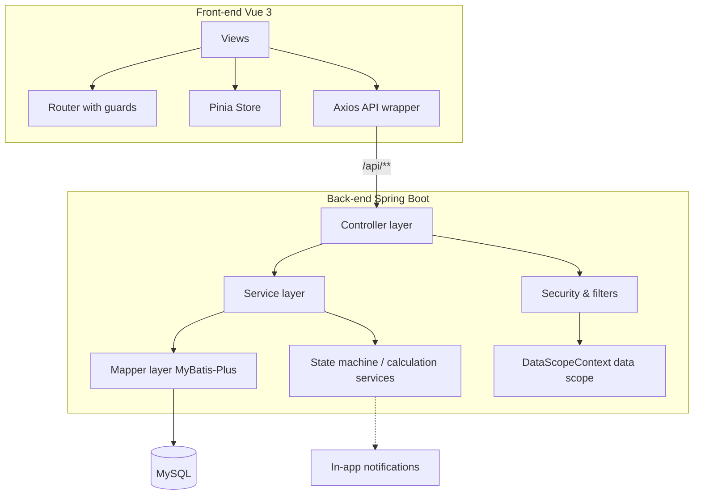

# PerfFlow Performance Management System

**[English](README_EN.md)** | **[中文](README.md)**

PerfFlow is an enterprise performance management platform covering two core business lines — **individual performance** and **department performance**. It provides end-to-end digital management from assessment period publishing, indicator entry, and multi-level approval to automatic scoring, grade-linked calibration, and progress dashboards. The system adopts a decoupled front-end/back-end architecture with fine-grained permission isolation across eight roles and a defense-in-depth security model, making it suitable for small and medium-sized organizations that need standardized performance management.

## Table of Contents

- [Background & Objectives](#background--objectives)
- [Core Features](#core-features)
- [Overall Architecture](#overall-architecture)
- [Roles & Permission Model](#roles--permission-model)
- [Key Design Concepts](#key-design-concepts)
- [Directory Structure](#directory-structure)
- [Environment Requirements](#environment-requirements)
- [Build & Run](#build--run)
- [Configuration](#configuration)
- [Database Design](#database-design)
- [Testing](#testing)
- [Usage Examples](#usage-examples)
- [Extension & Maintenance](#extension--maintenance)
- [Known Issues](#known-issues)
- [Contributing](#contributing)

---

## Background & Objectives

Traditional performance appraisal processes often suffer from fragmented workflows, inconsistent scoring criteria, blurred permission boundaries, and non-uniform statistics. PerfFlow addresses these pain points through **standardization, auditability, and extensibility**:

- **Standardized workflow**: Individual assessment (publish → fill → review → score → grade) and department assessment (fill → review → audit → approve → grade) are enforced by controlled state machines, preventing out-of-order transitions and duplicate submissions.
- **Fine-grained permissions**: Eight roles with clear responsibilities, dual authentication on both front-end and back-end, and data isolation by role and department to prevent unauthorized access.
- **Automated calculation**: Self-evaluation, leadership scoring, department grades, and employee quota linkage are all computed on the back-end to guarantee consistent criteria.
- **Full auditability**: Workflow transitions and score adjustments are logged, ensuring traceability of assessment results.

> This project is a fully runnable implementation: 132 Java source files on the back-end and 63 pages/type files on the front-end, all passing compilation and unit tests.

---

## Core Features

- **Individual assessment**: Publish a period (seven types) → import assessment details via Excel → employees fill in completion rates and submit (suspended) → HR pushes → department review (with score/plus-minus adjustments) → leadership scoring → automatic scoring and grading.
- **Department assessment**: HR publishes a department-line period → performance specialists fill in department KPIs → department head reviews → operations department audits → performance committee approves → department grade calculated automatically → employee quota linkage.
- **Grade linkage**: Based on department grade and staff level, rank individual assessments by final score and fill A/B/C/D grades according to quota ratios.
- **Progress dashboard**: Aggregates fill, review, and overdue statistics by department to support management decisions.
- **In-app notifications**: Automatically triggered by workflow nodes, scheduled reminders, and grade calculation completion.
- **Excel import/export**: Batch import of assessment details, template downloads, result export, and printable HTML.

### Back-end Modules

| Module | Controllers | Endpoint Prefix | Responsibility |
|---|---|---|---|
| `auth` | `AuthController` | `/auth/**` | Login, token refresh, password change, profile |
| `system` | `SysUserController` / `SysDeptController` / `UserOptionController` / `DeptOptionController` | `/admin/users`, `/admin/depts`, `/users/options`, `/departments/options` | Department & user management, role/department dropdowns |
| `period` | `PeriodController` | `/periods` | Period publishing (seven types), activation (individual/department lines), detail import |
| `assessment` | `AssessmentTableController` / `AssessmentFlowController` / `AssessmentRowController` / `AssessmentExportController` | `/assessment-tables` | Individual assessment tables, workflow transitions, row details, export |
| `deptassessment` | `DeptAssessmentController` | `/dept-assessments` | Department assessment four-level approval and KPI entry |
| `grade` | `GradeController` | `/grade` | Grade quota config, weight config, grade linkage calculation |
| `monitor` | `MonitorController` | `/monitor` | Assessment progress statistics |
| `notification` | `NotificationController` | `/notifications` | In-app notifications |
| `audit` | `AdjustLogController` | `/audit-logs` | Audit logs for score adjustments |
| `home` | `HomeController` | `/home` | Dashboard todos and warnings |
| `common/excel` | `ExcelController` | `/excel` | Template download and detail import |

### Front-end Pages (by Role Menu)

| Page | Route | Visible Roles |
|---|---|---|
| Dashboard | `/home` | All roles |
| Profile | `/profile` | All roles |
| Notifications | `/notifications` | All except ADMIN |
| My Assessment | `/me/assessment` | EMP |
| Department Review | `/dept/review` | DEPT_LEAD |
| Leadership Scoring | `/lead/score` | LEAD |
| Period Management | `/hr/period` | PERFORMANCE_HR |
| Assessment List | `/hr/list` | LEAD / PERFORMANCE_HR |
| Department Assessment Entry | `/dept-staff/assessment` | DEPT_STAFF |
| Progress Dashboard | `/operation/dashboard` | OPERATION / COMMITTEE |
| Department Audit | `/operation/dept-audit` | OPERATION |
| Department Approval | `/committee/approve` | COMMITTEE |
| User Management | `/admin/users` | ADMIN |
| Department Management | `/admin/depts` | ADMIN |

---

## Overall Architecture

### Technology Stack

| Tier | Stack |
|---|---|
| Back-end | Spring Boot 3.3.4, Java 17, Spring Security, MyBatis-Plus 3.5.9, jjwt 0.12.6, springdoc-openapi 2.6.0, Hutool 5.8.30, Apache POI 4.1.2, Lombok |
| Front-end | Vue 3.5, TypeScript 5.7, Vite 6, Element Plus 2.9, Pinia, Vue Router, ECharts 6, dayjs |
| Database | MySQL 8.0+ (utf8mb4 / InnoDB) |
| Testing | JUnit 5 + Spring Boot Test + Spring Security Test + H2 (in-memory) |

### Layered Architecture



- **Controller layer**: Parameter validation, `@PreAuthorize` declarations, unified response wrapping.
- **Service layer**: Business orchestration, transaction boundaries, state transitions, calculation logic.
- **Mapper layer**: CRUD via MyBatis-Plus `BaseMapper`; complex conditions built with `QueryWrapper` / `LambdaUpdateWrapper`.
- **Security layer**: `JwtAuthenticationFilter` parses and validates tokens; `DataScopeContext` carries the current user and data scope.

---

## Roles & Permission Model

The system defines eight roles, maintained centrally through the `RoleConst` constants.

| Role | Code | Responsibility |
|---|---|---|
| System Admin | `ADMIN` | Department/user management; cannot operate on self or manage the performance HR account |
| Performance HR | `PERFORMANCE_HR` | Publish periods, select assessees, import Excel, push and suspension management (not assessed) |
| Company Leader | `LEAD` | Scores pushed assessment tables (own table scored by the performance committee) |
| Department Head | `DEPT_LEAD` | Reviews subordinates' self-assessments; may adjust scores and plus-minus items |
| Employee | `EMP` | Fills completion rate and submits self-assessment |
| Department Staff | `DEPT_STAFF` | Fills department KPIs and initiates department assessment |
| Operations | `OPERATION` | Views company-wide data, audits department assessment, views audit logs, triggers grade calculation |
| Performance Committee | `COMMITTEE` | Final approval of department assessment; scores LEAD personal assessment tables |

**Special rule**: The company leader (LEAD) has no department; their personal assessment table is scored by the performance committee, and after HR push it skips department review and goes directly to leadership scoring. Assessee roles cover EMP / DEPT_LEAD / LEAD / DEPT_STAFF / OPERATION / COMMITTEE (excluding ADMIN and PERFORMANCE_HR).

---

## Key Design Concepts

### 1. Defense-in-Depth Permissions

Front-end routes and buttons only control presentation; all authorization is independently enforced on the back-end:

- **Method-level authorization**: `@PreAuthorize` declares the roles required by each endpoint.
- **Data-level authorization**: `AssessmentPermissionService` appends visibility conditions by role and department (`scopeOf`) and controls field masking of scores (`isRowMasked`).
- **Business isolation**: `AdminBusinessGuardInterceptor` blocks administrators from accessing business endpoints, returning 403.

### 2. JWT and Single-Session Kick-out

- Access token TTL is 2 hours; refresh token TTL is 7 days. Tokens carry a `token_version` claim.
- The token version is compared against `sys_user.token_version`; a mismatch marks the token as stale, implementing "new login invalidates the old device".

### 3. Data Scope Context

`DataScopeContext` uses `ThreadLocal` to hold the current user ID, primary role, and department ID during a request lifecycle, and is cleared when the filter finishes to avoid context leakage across thread reuse. List queries append visibility scopes dynamically to prevent unauthorized access.

### 4. State Machine and Concurrency Control

- `AssessmentStateMachine` / `DeptAssessmentStateMachine` centrally maintain legal transition tables; every transition is validated first.
- Write operations uniformly use **atomic conditional updates** (`UPDATE ... WHERE state = expected`), transitioning only while still in the expected state, combined with optimistic locking to prevent concurrent duplicate submissions.

### 5. Grade Linkage Calculation

`GradeCalculationService` runs after department assessment is graded:

- Matches quota ratios by `department grade × staff level`, ranks by final score in descending order, then fills A/B/C/D grades.
- Middle management (DEPT_LEAD) final score = department score × department weight + personal score × personal weight (weights configurable); employees (BASIC) do not blend the department score.
- To avoid re-applying historical blended results, the personal component is always recomputed from self/leadership scores rather than reading back the old `final_score`.

### 6. Excel Import/Export

Built on Hutool-POI + Apache POI with `ExportStyleUtil` (style caching and layout operations) and `ExcelReadUtil` (type-safe cell reading). Supports template download, batch import, result export, and printable HTML. Imports are idempotent, overwriting by sequence number.

### 7. Scheduled Tasks and Auditing

| Time | Task | Description |
|---|---|---|
| 08:00 daily | Suspension expiry reminder | Warns within 3 days before suspension ends |
| 23:00 daily | Auto-push | Auto-pushes overdue suspended tables into department review when auto-push is enabled |

Score adjustments and workflow transitions are written to `adjust_log` / workflow log tables, hidden from the front-end by default, and available to operations and administrators for auditing.

---

## Directory Structure

```
perftlow/
├── README.md                     # Chinese documentation
├── README_EN.md                  # English documentation
├── DEPLOY.md                     # Deployment guide
├── LICENSE
├── docs/
│   └── code-review/              # Code review reports (multi-round archive)
├── backend/                      # Spring Boot back-end
│   ├── sql/
│   │   ├── perfflow.sql          # Schema script (12 tables + seed data)
│   │   └── seed_data.sql         # Demo seed data
│   └── src/
│       ├── main/java/com/perfflow/
│       │   ├── PerfFlowApplication.java
│       │   ├── module/           # Business modules (assessment/deptassessment/grade/
│       │   │                     #  home/monitor/notification/period/system/audit/auth)
│       │   ├── security/         # JWT filter, data scope context, authenticated user
│       │   ├── config/           # Security / MyBatis-Plus / MVC / OpenAPI / interceptors
│       │   ├── common/           # Unified response, error codes, global exceptions, enums, Excel utils
│       │   └── task/             # Scheduled and async tasks
│       ├── main/resources/
│       │   ├── application.yml   # Main config (port / JWT / scheduler / scoring)
│       │   ├── application-dev.yml
│       │   └── application-prod.yml
│       └── test/java/com/perfflow/  # Unit tests
└── frontend/                     # Vue 3 front-end
    ├── src/
    │   ├── api/                  # Axios API wrappers
    │   ├── views/                # Pages (grouped by role)
    │   ├── router/               # Router and guards
    │   ├── store/                # Pinia (auth/app)
    │   ├── layout/               # Sidebar menu
    │   └── types/                # TS types and enums
    ├── nginx.conf                # Production Nginx config
    ├── Dockerfile                # Front-end container build
    └── vite.config.ts            # Build and /api proxy config
```

---

## Environment Requirements

| Software | Version | Notes |
|---|---|---|
| JDK | 17 | Back-end compile and runtime |
| Maven | 3.8+ | Back-end build |
| MySQL | 8.0+ | Storage (utf8mb4 / InnoDB) |
| Node.js | 18+ (20 recommended) | Front-end build |
| npm | 9+ | Front-end dependency management |

---

## Build & Run

### 1. Initialize the Database

```bash
mysql -u root -p < backend/sql/perfflow.sql
```

`perfflow.sql` creates the database, the 12 tables, and base seed data (departments, users, grade quotas, weight configs). Assessment periods and tables are not pre-seeded; they are generated automatically when HR publishes and activates a period.

### 2. Configure the Database Connection

Edit `backend/src/main/resources/application-dev.yml` and adjust `spring.datasource.url`, `username`, and `password`.

### 3. Start the Back-end

```bash
cd backend
mvn -DskipTests package
java -jar -Dspring.profiles.active=dev target/perfflow-backend.jar
```

The service listens on `8080` with context path `/api`; the API documentation is available at `http://localhost:8080/api/swagger-ui.html`.

### 4. Start the Front-end

```bash
cd frontend
npm install
npm run dev        # http://localhost:5173
```

In development, Vite proxies `/api` to `http://localhost:8080`, so no extra CORS configuration is required.

### Common Commands

| Operation | Command |
|---|---|
| Compile back-end | `cd backend && mvn compile` |
| Test back-end | `cd backend && mvn test` |
| Package back-end | `cd backend && mvn -DskipTests package` |
| Type-check front-end | `cd frontend && npm run type-check` |
| Build front-end | `cd frontend && npm run build` |

> Production deployment (Docker / Nginx / Railway / Vercel) is documented in `DEPLOY.md` and `frontend/Dockerfile`, `frontend/nginx.conf`.

---

## Configuration

### Back-end Main Config (`application.yml`)

| Key | Default | Description |
|---|---|---|
| `server.port` | `8080` | Service port |
| `server.servlet.context-path` | `/api` | Unified endpoint prefix |
| `spring.jackson.date-format` | `yyyy-MM-dd HH:mm:ss` | Date serialization format |
| `spring.jackson.time-zone` | `Asia/Shanghai` | Time zone |
| `spring.servlet.multipart.max-file-size` | `20MB` | Max upload size |
| `mybatis-plus.mapper-locations` | `classpath:/mapper/*.xml` | Mapper XML location (business currently uses BaseMapper, no XML) |
| `perfflow.jwt.secret` | see config | HMAC key (≥32 bytes); must be replaced in production |
| `perfflow.jwt.access-token-ttl-seconds` | `7200` | Access token TTL (seconds) |
| `perfflow.jwt.refresh-token-ttl-seconds` | `604800` | Refresh token TTL (seconds) |
| `perfflow.default-pwd` | `12345678` | Initial password; overridable via `PERFFLOW_DEFAULT_PWD` |
| `perfflow.scheduler.pending-reminder-cron` | `0 0 8 * * ?` | Suspension reminder cron |
| `perfflow.assess.*` | see config | Plus-minus item sequence range and cap |

### Environment Configurations

- **dev** (`application-dev.yml`): local MySQL (`localhost:3306/perfflow`), Hikari pool max 20 / min 5, logs to `logs/perfflow-dev.log`.
- **prod** (`application-prod.yml`): datasource and credentials injected via environment variables (`DB_HOST` / `DB_PORT` / `DB_NAME` / `DB_USER` / `DB_PWD`), logs to `/var/log/perfflow/perfflow-prod.log`.

---

## Database Design

| Domain | Table(s) | Description |
|---|---|---|
| Base | `sys_department` / `sys_user` | Departments / users (with `token_version`, `must_change_password`) |
| Individual assessment | `assessment_period` / `assessment_table` / `assessment_row` / `assessment_flow_log` | Periods (seven types) / main tables (with grade linkage fields) / row details / workflow logs |
| Department assessment | `dept_assessment` / `dept_kpi_row` | Department assessment main tables (optimistic lock `version`) / KPI detail rows |
| Grade config | `grade_quota_config` / `weight_config` | Quota ratios / weight config |
| Support | `adjust_log` / `notification` | Adjustment audit logs / in-app notifications |

---

## Testing

### Back-end Unit Tests

Unit tests cover the state machines and core calculation logic:

```bash
cd backend && mvn test
```

Existing test classes:

| Test Class | Coverage |
|---|---|
| `AssessmentStateMachineTest` | Legal/illegal individual assessment transitions |
| `AssessmentCalcServiceTest` | Self-score, total, grade mapping calculations |
| `DeptAssessmentStateMachineTest` | Department assessment transitions |
| `DeptScoreCalcTest` | Department score calculation |
| `DeptAssessmentFlowServiceTest` | Department assessment workflow logs |

Tests use an H2 in-memory database for isolation and do not depend on a local MySQL instance.

### Front-end Type Check

```bash
cd frontend && npm run type-check
```

### Suggested Additions

- Add integration tests (`@SpringBootTest`) for core service transactions and permission branches.
- Add boundary cases for Excel import/export (empty rows, out-of-order sequence numbers, out-of-range scores, invalid types).

---

## Usage Examples

All accounts share the initial password `12345678` and must change it on first login.

| Role | Account | Department |
|---|---|---|
| System Admin | `admin` | — |
| Performance HR | `hr` | — |
| Company Leader | `leader` | — |
| Department Head | `bumen1` / `bumen2` | Tech / Product |
| Employee | `emp01` / `emp02` / `wanggong` / `emp03` | Tech / Product |
| Department Staff | `deptstaff` | Tech |
| Operations | `yunying` | HR |
| Performance Committee | `weiyuan` | HR |

Login example:

```bash
curl -X POST http://localhost:8080/api/auth/login \
  -H "Content-Type: application/json" \
  -d '{"username":"hr","password":"12345678"}'
```

---

## Extension & Maintenance

### Extension Directions

- **Notification channels**: Currently in-app only; abstract a `NotificationChannel` interface to integrate email, WeCom, or DingTalk.
- **Approval flow visualization**: Migrate the hard-coded state machine to a configurable process definition (e.g., Flowable) for dynamic node orchestration.
- **Reporting enhancements**: Extend the progress dashboard with multi-dimensional statistics and export.

### Maintenance Points

- **State/enum consistency**: When adding assessment types or states, update the state machine transition tables, enums, and front-end type mappings in sync.
- **Permission regression**: After adjusting role visibility, cross-check `AssessmentPermissionService` against front-end route guards.
- **Secrets and credentials**: In production, always inject the JWT secret and database credentials via environment variables; never commit sensitive configuration.
- **Data migration**: Schema changes should ship idempotent incremental migration scripts rather than modifying the full `perfflow.sql` script.
- **Code standards**: Follow the Alibaba Java Development Manual; quality review reports are available under `docs/code-review/`.

---

## Known Issues

- Table 4 (plus-minus application) and Table 6 (quarterly adjustment) currently only provide "type + import format hints + mapping to existing detail tables"; no standalone table structure exists.
- In grade linkage with very small populations (e.g., 2 people), quota rounding down may assign all D grades; this is a known simplification.
- Development context, verification records, and TODOs are archived under `docs/`.

---

## Contributing

Issues and pull requests are welcome. Before submitting, please ensure `mvn test` and `npm run type-check` pass and keep the style consistent with the existing codebase.
